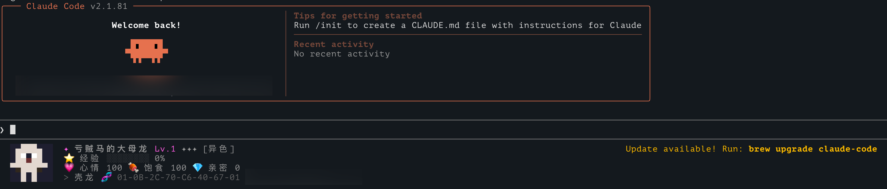

# 🐾 Claude MiniPet

A virtual pet that lives in [Claude Code](https://docs.anthropic.com/en/docs/claude-code)'s terminal. It accompanies you while coding — gaining experience, leveling up, and evolving along the way.

一只住在 [Claude Code](https://docs.anthropic.com/en/docs/claude-code) 终端里的虚拟宠物。在你编程时它会陪伴在终端底部，随着你的 coding 活动获得经验、升级、进化。

> **Prerequisites / 前提条件：** This is a Claude Code extension plugin. Node.js and Claude Code must be installed first. / 本工具是 Claude Code 的扩展插件，需要先安装 Node.js 和 Claude Code。

<p align="center">
  
</p>

<p align="center">
  
  
  
</p>

## Prerequisites / 环境准备

### 1. Install Node.js / 安装 Node.js

Download from [nodejs.org](https://nodejs.org/) (LTS >=18), or use a package manager:

前往 [Node.js 官网](https://nodejs.org/) 下载 LTS 版本（>=18），或使用包管理器：

```bash
# macOS (Homebrew)
brew install node

# Ubuntu / Debian
curl -fsSL https://deb.nodesource.com/setup_22.x | sudo -E bash -
sudo apt-get install -y nodejs

# Windows (winget)
winget install OpenJS.NodeJS.LTS
```

### 2. Install Claude Code / 安装 Claude Code

See [Claude Code docs](https://docs.anthropic.com/en/docs/claude-code):

参考 [Claude Code 官方文档](https://docs.anthropic.com/en/docs/claude-code)：

```bash
npm install -g @anthropic-ai/claude-code
```

## Install MiniPet / 安装 MiniPet

```bash
npm install -g claude-minipet && claude-minipet init
```

One command to install and set up. The interactive guide walks you through:

一条命令完成安装和配置，交互式引导流程：

```
🐾 欢迎使用 Claude MiniPet!

📧 请输入你的邮箱: you@example.com
📤 发送验证码中...
✅ 验证码已发送到你的邮箱

🔑 请输入验证码: 483721
✅ 登录成功!

✨ 一只新的宠物诞生了! ✨
种族: 壳龙 (Shelldragon)
稀有度: ★★★ [传说]
🧬 DNA: A3-F7-2B-E1-8C-D4-09-5F

✅ Claude Code hooks 已配置
✅ 守护进程已启动
☁️ 宠物数据已上传到云端

重启 Claude Code 就能看到你的宠物了! 🎉
```

Restart Claude Code and your pet will appear in the status line at the bottom.

重启 Claude Code 后宠物就会出现在终端底部的 status line 里。

## Usage / 使用

```bash
claude-minipet status            # View pet details / 查看宠物详细状态
claude-minipet feed              # Feed pet (hunger +30) / 喂食（饱食度 +30）
claude-minipet pat               # Pat pet (mood +10, bond +2) / 摸摸（心情 +10，亲密 +2）
claude-minipet rename <name>     # Rename pet / 给宠物改名
claude-minipet redeem <code>     # Redeem a pet code / 兑换码兑换宠物
claude-minipet sync              # Sync cloud data / 手动同步云端数据
```

No manual action needed during daily use — your pet gains EXP, levels up, and evolves automatically as you code with Claude Code. Data syncs to cloud in the background.

日常使用不需要手动操作 — 宠物会在你用 Claude Code 编程时自动获得经验、升级、进化，数据自动同步到云端。

## Redeem Codes / 兑换码

Redeem a code to get a specific species and rarity pet:

通过兑换码可以获得指定种族和稀有度的宠物：

```bash
claude-minipet redeem XXXX-XXXX-XXXX
```

Your current pet will be replaced with a new Lv.1 pet. Codes are generated and distributed by administrators.

兑换后当前宠物会被替换为新宠物（Lv.1 重新培养）。兑换码由管理员生成分发。

## Features / 特性

- **🎲 Procedural Generation / 程序化生成** — Every pet is unique, generated via a DNA system / 每只宠物独一无二，基于 DNA 系统随机生成外观
- **🐱 6 Species / 6 个种族** — Bitcat, Shelldragon, Codeslime, Gitfox, Bugowl, Pixiebot, each with passive bonuses / 位猫、壳龙、码史莱姆、吉狐、虫枭、像素精灵，各有专属被动技能
- **✨ 5 Rarity Tiers / 5 级稀有度** — Common(60%) / Uncommon(25%) / Rare(10%) / Legendary(4%) / Shiny(1%)
- **📈 Nurture System / 养成系统** — Level, EXP, Mood, Hunger, Bond / 等级、经验、心情、饱食度、亲密度
- **🧬 Evolution Branches / 进化分支** — 3-stage evolution, your coding habits decide the path / 3 阶段进化，编程习惯决定进化方向
- **🎨 Pixel Art Rendering / 像素画渲染** — Unicode half-blocks + ANSI 24-bit true color
- **💫 Multi-frame Animation / 多帧动画** — Blink, eat, level up, evolve effects / 眨眼、进食、升级、进化等动态效果
- **☁️ Cloud Sync / 云端同步** — Email login, auto-sync, cross-device / 邮箱登录，数据自动同步，跨设备使用

## EXP Gain / 经验获取

Your pet gains EXP automatically while you use Claude Code:

使用 Claude Code 的过程中，宠物会自动获得经验：

| Event / 事件 | EXP / 经验值 |
|------|--------|
| Send message / 发送消息 | +2 |
| Bash command / Bash 命令 | +3 |
| Edit/Write file / 编辑文件 | +5 |
| Read file / 读取文件 | +1 |
| Test passes / 测试通过 | +10 |
| Git commit | +15 |
| Create PR / 创建 PR | +20 |

## Species / 种族

| Species / 种族 | Passive Bonus / 被动技能 |
|------|---------|
| 🐱 Bitcat 位猫 | Happy when reading files / 读文件时特别开心 |
| 🐉 Shelldragon 壳龙 | 2x EXP from Bash / Bash 命令双倍经验 |
| 🟢 Codeslime 码史莱姆 | -20% EXP to level / 升级经验需求 -20% |
| 🦊 Gitfox 吉狐 | Extra EXP from Git / Git 操作额外经验 |
| 🦉 Bugowl 虫枭 | 2x EXP from tests / 测试双倍经验 |
| 🤖 Pixiebot 像素精灵 | Half mood decay / 心情衰减减半 |

## Evolution / 进化

Each species has 3 evolution stages (Baby → Growth → Final) with 2-3 branches per stage. Evolution direction depends on your coding habits:

每个种族有 3 个进化阶段（幼年体 → 成长体 → 完全体），每阶段 2-3 个分支。进化方向取决于你的编程习惯：

- Write more code → Code-type evolution / 写代码多 → 代码系进化
- Run more commands → Command-type evolution / 跑命令多 → 命令系进化
- High bond → Special evolution / 亲密度高 → 特殊进化
- Stay happy → Light-type evolution / 保持好心情 → 光系进化

## License

MIT
